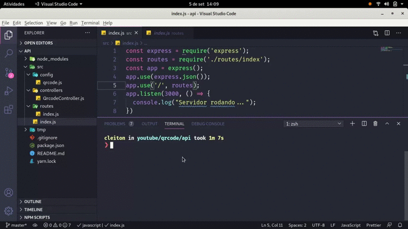

<h1 align="center">
    
    <br>
    Generate QRCode
</h1>

<h4 align="center">
Animation showing a little of how the api works.
</h4>

<p align="center">
  <a href="#rocket-technologies">Technologies</a>&nbsp;&nbsp;&nbsp;|&nbsp;&nbsp;&nbsp;
  <a href="#information_source-how-to-use">How To Use</a>&nbsp;&nbsp;&nbsp;|&nbsp;&nbsp;&nbsp;
  <a href="#memo-license">License</a>
</p>

<p align="center">
  
</p>

## Technologies

This project was developed with the following technologies:

-  [Node.js][nodejs]
-  [Express](https://expressjs.com/)
-  [VS Code][vc]
-  [node-qrcode](https://www.npmjs.com/package/qrcode)

## How To Use

To clone and run this chat, you need [Git](https://git-scm.com/), [Node.js v14.15.0][nodejs] or higher and [Yarn v1.22.5][yarn] or higher installed on your computer.

From your command line:

```bash
# Clone this repository
$ git clone https://github.com/juancleiton/generate-qrcode-nodejs

# Go into the repository
$ cd generate-qrcode-nodejs

# Install dependencies
$ yarn install

# Run the server
$ yarn start
```

To know that the server is running, see if it makes this return in the terminal
```bash
#Output
Server running on port 3000
```
Open your favorite browser and enter the URL http://localhost:3000

To generate the QRCode with your customized text, just insert a GET parameter in the URL.
```
http://localhost:3000?text=your-text
```
## About The Project

If you need a light, fast and efficient solution to generate QRCode, then this project was born for you. Generate your custom code in a simple way.

## :memo: License
This project is under the MIT license. See the [LICENSE](https://github.com/lukemorales/react-native-design-code/blob/master/LICENSE) for more information.

---

Made with ♥ by Juan Cleiton :wave: [Get in touch!](https://www.linkedin.com/in/juancleiton30/)

[nodejs]: https://nodejs.org/
[yarn]: https://yarnpkg.com/
[vc]: https://code.visualstudio.com/